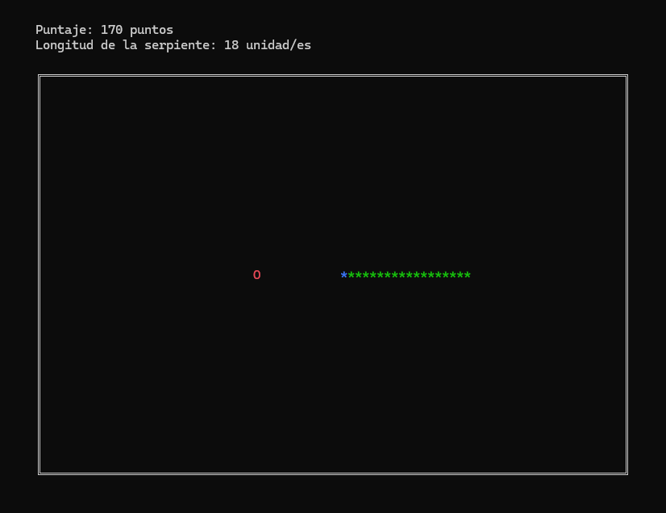

# snake-aed

Implementación en C del clásico Snake para el TPI de AED. Nuestro grupo está compuesto por:

* Benchat Parra, Lucas Ivan
* Fedorchuk, Francisco Nicolás
* Romaniuk, Lucas Genaro
* Yaya, Franco Gabriel

Estas versión tiene incorporada las funcionalidades básicas y comunes de cualquier implementación del Snake, como el morir al chocar con muros y con la misma serpiente, así como el crecer al
comer manzanas.

También incorporamos un sistema de puntuación básico, que permite a los jugadores guardar sus puntajes, así como la máxima longitud que llegó a tener la serpiente en sus partidas.

## Informe Técnico
Desde [acá](https://docs.google.com/document/d/1h6XhwBlpBwTi9dpRz9Lel1f6QWEVF6j6EzNz_bh174Y) se puede acceder al informe técnico de la experiencia, solicitado por la cátedra.
